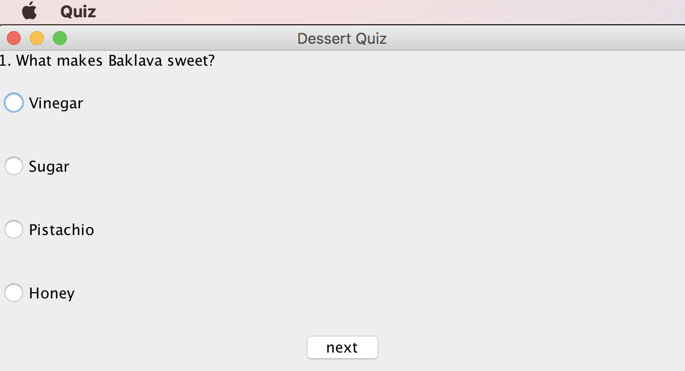
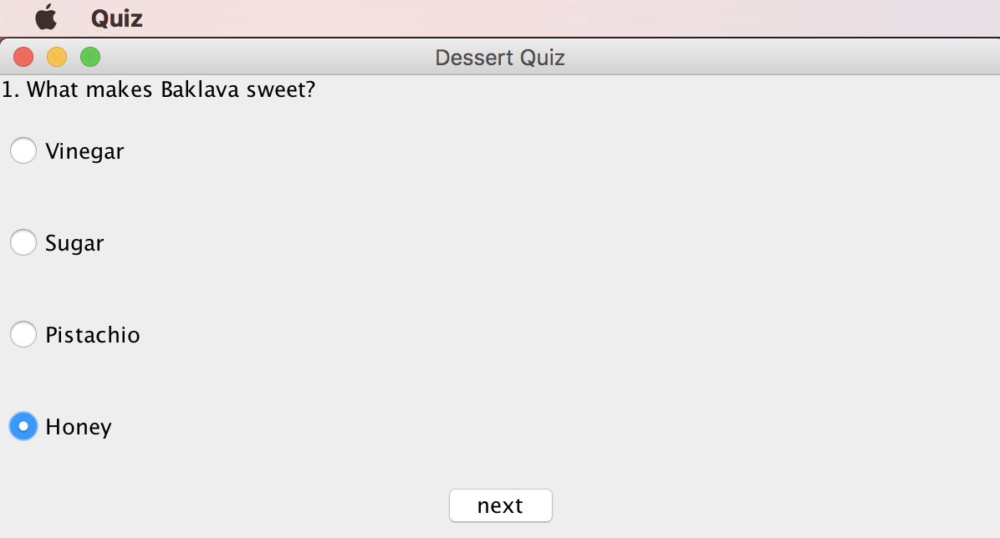
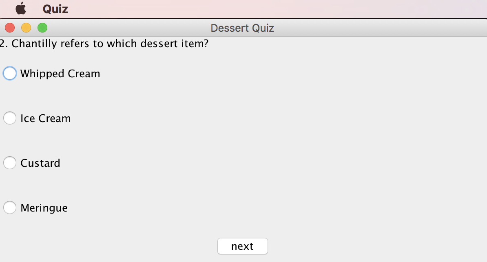
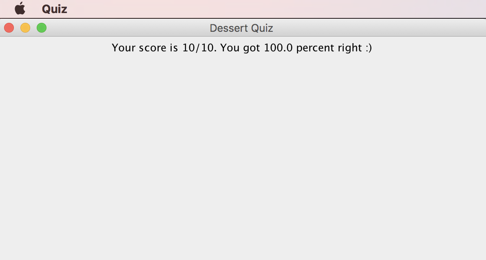
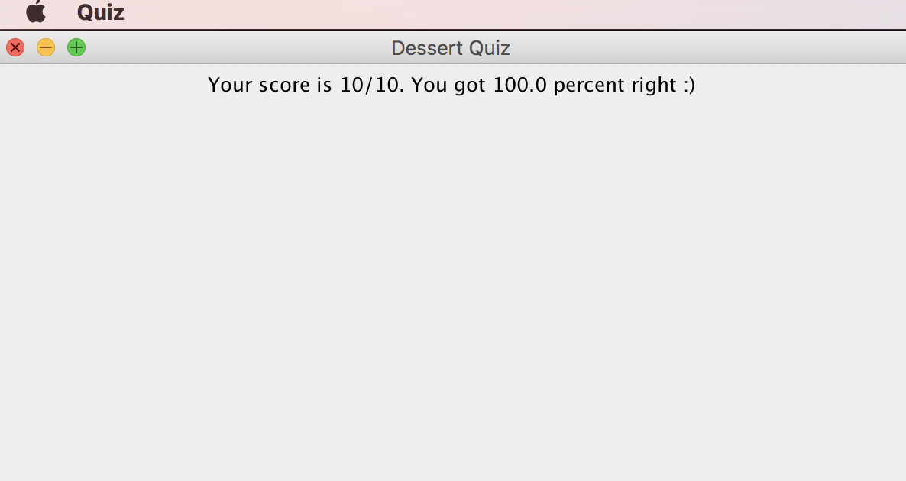
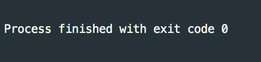

# Programming Coursework

## PART I: GUI-based Online Testing System

By Shannon Sullivan

### Project overview

#### Object Oriented Structure

To give the project a logical structure it divides functionality into four classes:

`Quiz.java` - Similar to a `main` class, this class runs the entire program

`QuizCompiler.java` - Manages all file interaction. Reads questions and answers from text files and converts them into the correct data structures.

`QuizInterface.java` - Handles the mechanics of asking questions and accepting answers. Implements the UI and UI logic, using the Java Swing framework.

`Question.java` - Gives a java-like interface to interact with the data

#### Features

The project implements all of the standard requirements of this assignment, as specified in exercises 1 - 8 of the specs. Test cases are located in Appendix A, and
source code is listed in Appendix B.

### Evaluation
One particular place for improvement in the current implementation of this program would be in how answers
are stored and retrieved from the text file. They are currently inserted line by line in a text file, and should the quiz
someday grow to many more than 10 questions, it could get very confusing inserting new answers. A solution would be a way to group them more neatly in the
text file, and have the program read the text file more elegantly than simply line by line. I chose the current implementation
as it served the purposes of this exercise.

While writing this program, it because very apparent to me that this program would be very well suited to
a Model View Controller (MVC) style of software design. In further iterations, I would like to abstract my data into classes that follow a
 MVC pattern, and so rather than having `Quiz.java` and `QuizInterface.java` as classes that combine UI with logic, I'd prefer to have
 `QuizModel.java`, `QuizController.java`, and `QuizView.java` in which the data layer would be completely abstracted
 away from the user interface layer and it would be easier to manage the state of the application. Furthermore, I'd like to
 utilize better the principles of Object Oriented Programming in which each of the classes have a single responsibility.
 
 Finally, the user interface of this application is clunky, outdated, and does not offer the user a pleasing experience. Before adding
 advanced features to this application, I would like to re-write the UI layer using a framework other than Java Swing. Ideally, I would
 host it on the web and utilize HTML, CSS, and Javascript for frontend interactions, with a backend written in Java, and store user data on a database.
 

### Test Plan

|  | Test  | Method | Expected Result | Result |  Evidence |
| --- |:----:| :-----:| :-----:| :-----:| :---:|
| 1 | The first question and its answers are shown correctly | Run the quiz from the terminal | 1. What makes baklava sweet? | As expected | See Appendix A |
| 2 | The user can select only one answer| Clicks on several radio buttons | Only one radio button can be selected | As expected | See Appendix A |
| 3 | The next question and its answers are shown correctly | Click the "next" button after selecting an answer |2. Chantilly refers to which dessert item? | As expected | See Appendix A |
| 4 | The user's score is calculated correctly | Complete all ten quiz questions and click "next" | You scored 10/10. You got 100 percent :)| As expected | See Appendix A |
| 5 | The user's percentage is calculated correctly | Complete all ten quiz questions and click "next" | You scored 10/10. You got 100 percent :) | As expected | See Appendix A |
| 6 | The user can exit the quiz at any time | Click on the "x" button at the top of the window | The window closes | As expected | See Appendix A |

### Appendix A
| Test Number | Evidence |
| --- |:----:|
| 1 | |
| 2 | |
| 3 | |
| 4 | |
| 5 | |
| 6 | |

### Appendix B

Quiz.java
```java
/** Created by shannonsullivan on 5/30/17. */
import java.io.FileNotFoundException;
import java.util.List;

public class Quiz {
  public static void main(String[] args) throws FileNotFoundException {
    List<Question> quiz = QuizCompiler.compileQuiz();
    QuizInterface ui = new QuizInterface(quiz);
    ui.startQuiz();
  }
}
```
QuizCompiler.java
```java
import java.io.File;
import java.io.FileNotFoundException;
import java.util.ArrayList;
import java.util.List;
import java.util.Scanner;

/** Created by shannonsullivan on 6/9/17. */
public class QuizCompiler {
  public static List<Question> compileQuiz() throws FileNotFoundException {
    File questionsFile = new File("./src/txt/questions.txt");
    File answersFile = new File("./src/txt/answers.txt");
    File rightAnswerFile = new File("./src/txt/right-answers.txt");

    List<Question> questions = new ArrayList<>();
    Scanner questionsReader = new Scanner(questionsFile);
    Scanner answersReader = new Scanner(answersFile);
    Scanner rightAnswerReader = new Scanner(rightAnswerFile);

    while (questionsReader.hasNextLine()) {
      String text = questionsReader.nextLine();
      String[] answers = new String[4];
      for (int i = 0; i < 4; i++) {
        answers[i] = answersReader.nextLine();
      }
      String rightAnswer = rightAnswerReader.nextLine();

      questions.add(new Question(text, answers, rightAnswer));
    }

    return questions;
  }
}
```
Question.java
```java
/** Created by shannonsullivan on 5/31/17. */
public class Question {
  private String text;
  private String[] answers;
  private String rightAnswer;

  public Question(String text, String[] answers, String rightAnswer) {
    this.text = text;
    this.answers = answers;
    this.rightAnswer = rightAnswer;
  }

  public String getText() {
    return text;
  }

  public void setText(String text) {
    this.text = text;
  }

  public String[] getAnswers() {
    return answers;
  }

  public void setAnswers(String[] answers) {
    this.answers = answers;
  }

  public String getRightAnswer() {
    return rightAnswer;
  }

  public void setRightAnswer(String rightAnswer) {
    this.rightAnswer = rightAnswer;
  }
}
```
QuizInterface.java
```java
import javax.swing.*;
import java.awt.*;
import java.awt.event.ActionEvent;
import java.awt.event.ActionListener;
import java.util.List;

/** Created by shannonsullivan on 6/9/17. */
public class QuizInterface implements ActionListener {
  private JFrame frame;
  private int score;
  private List<Question> quiz;
  private int currentQuestionIndex;
  private String currentAnswer;

  public QuizInterface(List<Question> quiz) {
    this.quiz = quiz;
    this.currentQuestionIndex = 0;
    this.currentAnswer = "";
    this.score = 0;
    this.frame = new JFrame();
  }

  public void startQuiz() {
    askQuestion(quiz.get(currentQuestionIndex));
  }

  private void askQuestion(Question question) {
    JPanel mainPanel = new JPanel();
    JPanel questionPanel = new JPanel();
    JPanel answersPanel = new JPanel();
    JPanel controlsPanel = new JPanel();
    JButton submitButton = new JButton();

    // Make the question
    JLabel questionLabel = new JLabel();
    questionLabel.setText(question.getText());
    questionPanel.add(questionLabel);

    // Make the answers
    String[] answers = question.getAnswers();
    ButtonGroup answerGroup = new ButtonGroup();
    JRadioButton[] answerButtons = new JRadioButton[answers.length];
    for (int i = 0; i < answers.length; i++) {
      answerButtons[i] = new JRadioButton(answers[i]);
      answerButtons[i].setText(answers[i]);
      answerButtons[i].addActionListener(this);
      answerGroup.add(answerButtons[i]);
      answersPanel.add(answerButtons[i]);
    }

    // Setup panels
    mainPanel.setLayout(new BorderLayout());
    questionPanel.setLayout(new GridLayout(0, 1));
    answersPanel.setLayout(new GridLayout(0, 1));
    controlsPanel.setLayout(new FlowLayout());

    // Setup the button
    submitButton.setText("next");
    submitButton.setActionCommand("submit");
    submitButton.addActionListener(this);
    submitButton.setEnabled(true);

    // Load panels, add them to to frame
    questionPanel.add(questionLabel);
    controlsPanel.add(submitButton);

    mainPanel.add(questionPanel, BorderLayout.NORTH);
    mainPanel.add(answersPanel, BorderLayout.CENTER);
    mainPanel.add(controlsPanel, BorderLayout.SOUTH);

    // Setup the frame
    frame.add(mainPanel);
    frame.setTitle("Dessert Quiz");
    frame.pack();
    frame.setSize(600, 300);
    frame.setVisible(true);
    frame.setDefaultCloseOperation(JFrame.EXIT_ON_CLOSE);
  }

  public void actionPerformed(ActionEvent event) {
    if (event.getActionCommand().equals("submit")) {
      handleSubmit(event);
    } else {
      handleSelection(event);
    }
  }

  private void handleSubmit(ActionEvent event) {
    frame.dispose();
    frame = new JFrame();
    checkAnswer();
    if (currentQuestionIndex == quiz.size() - 1) {
      showResults();
    } else {
      askNextQuestion();
    }
  }

  private void askNextQuestion() {
    currentQuestionIndex += 1;
    askQuestion(quiz.get(currentQuestionIndex));
  }

  private void checkAnswer() {
    if (currentAnswer.equals(quiz.get(currentQuestionIndex).getRightAnswer())) {
      score += 1;
    }
  }

  private void handleSelection(ActionEvent event) {
    currentAnswer = event.getActionCommand();
  }

  private double calculatePercentage() {
    return ((double) score) / quiz.size() * 100;
  }

  private void showResults() {
    JPanel mainPanel = new JPanel();
    JPanel resultsPanel = new JPanel();
    JLabel resultsLabel = new JLabel();

    double percentage = calculatePercentage();

    if (percentage <= 50.0) {
      resultsLabel.setText(
          "Your score is "
              + score
              + "/"
              + quiz.size()
              + ". You got "
              + percentage
              + " percent right :(");
    } else {
      resultsLabel.setText(
          "Your score is "
              + score
              + "/"
              + quiz.size()
              + ". You got "
              + percentage
              + " percent right :)");
    }

    resultsPanel.add(resultsLabel);
    mainPanel.setLayout(new BorderLayout());
    mainPanel.add(resultsPanel, BorderLayout.CENTER);
    frame.add(mainPanel);
    frame.setTitle("Dessert Quiz");
    frame.pack();
    frame.setSize(600, 300);
    frame.setVisible(true);
    frame.setDefaultCloseOperation(JFrame.EXIT_ON_CLOSE);
  }
}
```
questions.txt
```
1. What makes Baklava sweet?
2. Chantilly refers to which dessert item?
3. Shaved ice originated in which country?
4. What is the primary ingredient in Horchata?
5. Chocolate was first consumed as a(n)?
6. The most expensive desert in the world is a(n)?
7. Croissants originated in which country?
8. What is the main ingredient of flan?
9. Which is the top selling flavor of ice cream?
10. Ice cream touches which part of your body to cause brain freeze?
```
answers.txt
```
Vinegar
Sugar
Pistachio
Honey
Whipped Cream
Ice Cream
Custard
Meringue
Italy
China
Japan
Russia
Cow Milk
Tiger Nut
Almond
Sheep Milk
Candy Bar
Soup
Alcoholic Beverage
Milkshake
Cake
Pie
Sundae
Cookie
Austria
Germany
France
Belgium
Flour
Eggs
Cream
Caramel
Chocolate
Strawberry
Pistachio
Vanilla
Tongue
Teeth
Throat
Roof of mouth
```
right-answers.txt
```
Honey
Whipped Cream
Japan
Tiger Nut
Alcoholic Beverage
Sundae
Austria
Eggs
Vanilla
Roof of mouth
```

